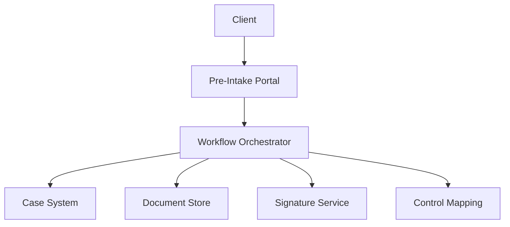
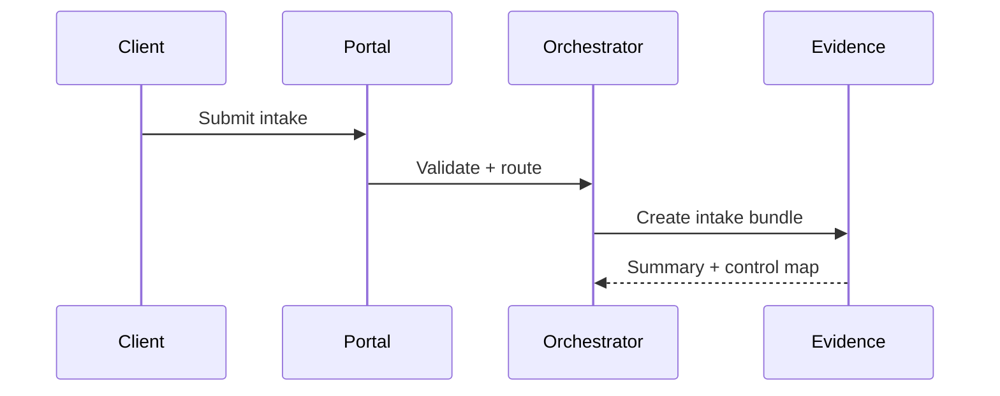
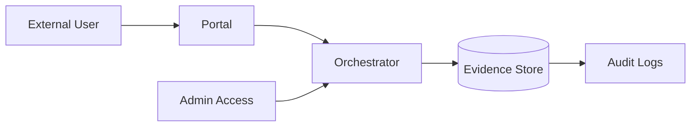

# GIAP - GRC Intake Automation Platform (Public Overview)

Privacy-first, self-hosted intake automation for GRC consulting. This is a public-safe, redacted overview that demonstrates GRC engineering capability without exposing proprietary workflows or client data.

## Live Demo
Access the public demo (read-only): https://portal.aamcyber.work/demo

## CI/CD (Private Repo)
This public overview mirrors a production repo that runs automated CI and deployment:
- CI: API and UI lint/test workflows on push and pull request
- CD: portal deploy workflow on main with secrets + secure remote sync

## What This Is
- Evidence-first intake automation with governance gates
- Multi-framework intake mapping and audit-ready summaries
- Privacy-preserving workflow orchestration

## Framework Alignment
- SOC 2: CC1, CC3, CC4, CC6, CC7
- NIST CSF: ID.AM, ID.GV, ID.RA, PR.AC, PR.DS, DE.CM
- ISO 27001: A.5, A.6, A.8, A.12, A.18

## High-Level Architecture (Redacted)

## Evidence Flow (Redacted)

## Threat Model (Redacted)

## Compliance Mapping (Sample)

| Control | Evidence Signal | Purpose |
| --- | --- | --- |
| SOC2 CC6 | Access control records | Identity and access governance |
| NIST PR.AC | Intake access logs | Authorized access validation |
| ISO A.8 | Data classification tags | Asset and data handling |

## Example Outputs
- `examples/giap-intake.json` - sanitized intake payload
- `examples/giap-summary.md` - redacted executive summary

## Demo-Only Flow (Conceptual)
1. Client submits pre-intake form.
2. Orchestrator stores intake and opens a case.
3. Engagement letter is generated and signed.
4. Control mapping summary is produced.
5. Intake package is ready for assessment.

## Key Decisions
- Deposit gate to enforce scope discipline.
- Evidence stored with minimal access paths.
- Redacted public outputs to protect IP and client privacy.

## Scope and Redaction
- Proprietary workflow logic, endpoints, and credentials are omitted.
- Examples are synthetic and non-client.

## Disclaimer
This is a public-safe overview. Do not use as a production system. No client data or proprietary infrastructure details are included.
