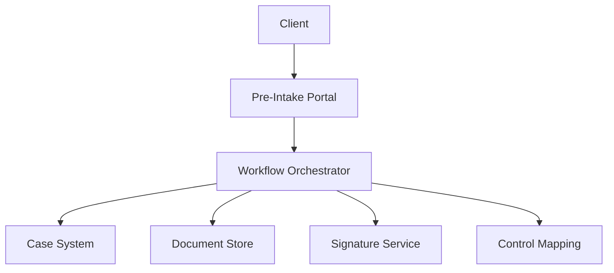

# GIAP - GRC Intake Automation Platform (Public Overview)

Privacy-first, self-hosted intake automation for GRC consulting. This public repo is a safe, redacted overview intended to demonstrate GRC engineering capability without exposing proprietary workflows or client data.

## Scope and Redaction
- This repo includes architecture, framework mapping, and example outputs.
- Proprietary workflow logic, production endpoints, and credentials are omitted.
- All examples are synthetic and non-client.

## Framework Alignment
- SOC 2: CC1, CC3, CC4, CC6, CC7
- NIST CSF: ID.AM, ID.GV, ID.RA, PR.AC, PR.DS, DE.CM
- ISO 27001: A.5, A.6, A.8, A.12, A.18

## What This Demonstrates
- Evidence-first intake design with governance gates
- Multi-framework intake mapping
- Privacy-preserving workflow orchestration
- Audit-ready output patterns

## High-Level Architecture (Redacted)

## Example Outputs
- `examples/giap-intake.json` - sanitized intake payload
- `examples/giap-summary.md` - redacted executive summary

## Demo-Only Flow (Conceptual)
1. Client submits pre-intake form.
2. Orchestrator stores intake and opens a case.
3. Engagement letter is generated and signed.
4. Control mapping summary is produced.
5. Intake package is ready for assessment.

## Disclaimers
This is a public-safe overview. Do not use as a production system. No client data, proprietary workflows, or production infrastructure details are included.
